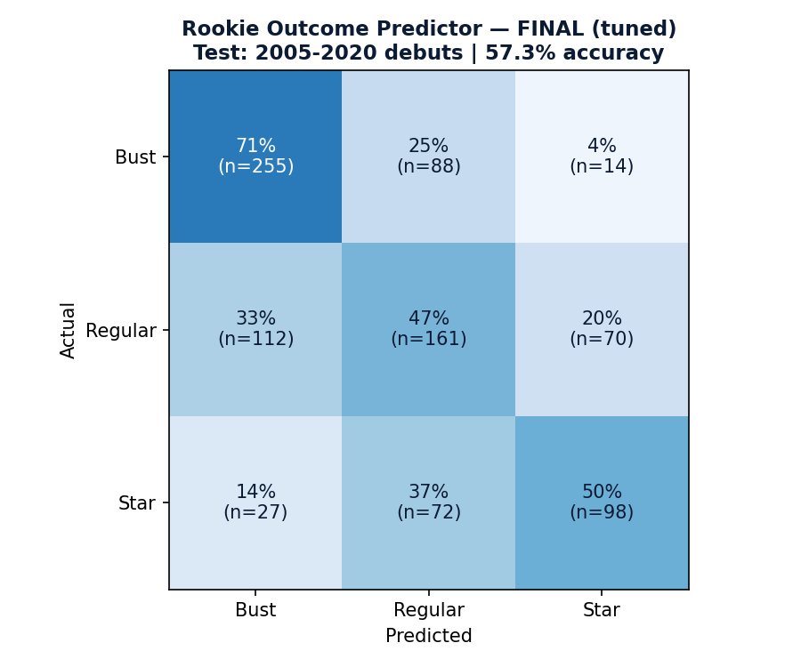
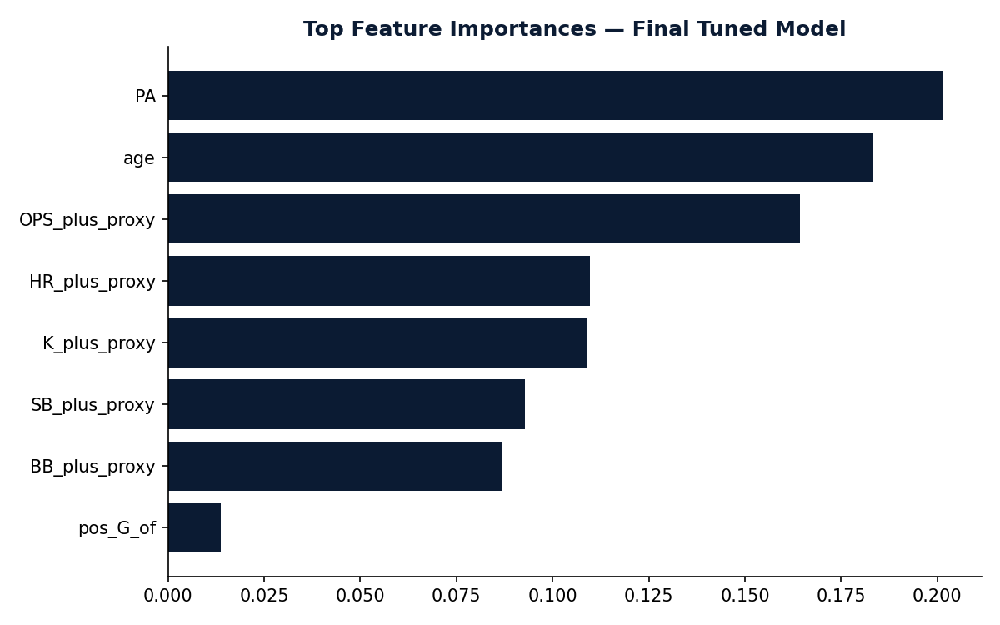

# EP Rookie Outcome Predictor

**Author:** Emerson Jimenez — Emerson Performance (EP)
**Part of the EP-TSP research series**

## Overview

Predicts a rookie hitter's likely career trajectory — **Bust**, **Regular**, or
**Star** — using only stats available from that player's own rookie season
(age, playing time, and rate stats), validated with a genuine time-based
train/test split (not random cross-validation) so the reported accuracy
reflects real out-of-sample performance: trained on rookies who debuted
1872–2004, tested on rookies who debuted 2005–2020, all outcomes measured
over each player's following five seasons.

## Method

1. **Rookie season definition**: a player's first season with 200+ plate
   appearances (Lahman `Batting.csv`, seasons aggregated across mid-year
   trades), **restricted to 1933 or later** (see Data Quality Fixes below)
   and **hitters only** (rows whose primary defensive position that season
   was pitcher are excluded).
2. **Features**: age at debut, PA, era-normalized OPS (player OPS ÷ that
   year's league-average OPS, an OPS+-style proxy), era-normalized HR rate
   (player HR/PA ÷ that year's league-average HR/PA), BB%, K%, SB, and
   primary defensive position (`Appearances.csv`).
3. **Outcome label** (measured over the 5 seasons following the rookie year):
   - **Star**: made at least one All-Star team in that window.
   - **Regular**: no All-Star appearance, but 300+ games played in the window.
   - **Bust**: neither — largely out of the majors within 5 years.
4. **Model**: Random Forest classifier (balanced class weights, since Stars
   are the minority class at ~23% of the sample).
5. **Validation**: time-based split — train on 1933–2004 debuts (n=2,945),
   test on 2005–2020 debuts (n=897). A genuine out-of-sample test, not a
   random split that could leak era-specific trends between train and test.

## Data Quality Fixes Found During Review — documented, not hidden

Two real methodological bugs were found and fixed while building this
project. Both are disclosed here rather than silently corrected, per EP-TSP
standards:

1. **Pre-1933 "Star" labels were structurally broken.** The All-Star Game
   did not exist before 1933. 34.8% of the initial dataset (2,062 of 5,920
   rookies) debuted before that date, and of those, only 1.5% could be
   labeled "Star" under this project's definition — not because they weren't
   good, but because the award the label depends on didn't exist yet for
   most of their eligible window. Every rookie who debuted before 1933 was
   removed from the dataset. This alone raised test-set accuracy from 49.3%
   to 56.7% (baseline: 39.8%, always-predict-Bust) — confirming this was a
   substantive labeling error, not a cosmetic one.
2. **Raw counting stats ignored era/offensive-environment shifts.** Rookie
   OPS averaged .599 in the 1880s versus .741 in the 2000s — a 0.14 gap
   driven by run-scoring environment, not talent. OPS and HR were replaced
   with era-normalized proxies (player value ÷ that season's league
   average) before the pre-1933 fix above; this alone moved accuracy from
   49.3% to 50.7%, and combined with the 1933 fix, to the final 56.7%.
3. **19th-century pitchers who also hit regularly were removed** (162 rows
   where the primary defensive position was pitcher) — this project is
   scoped to position players; a pitcher-focused version is a natural
   follow-up (see Next Steps).
4. **K%, BB%, and SB were also era-normalized** (same player-value ÷
   league-average-that-year approach as OPS/HR), since raw strikeout rate
   alone rose from 8.6% in the 1930s to 27.9% in the 2020s — a 3x shift.
   Unlike the OPS/HR fix, this one had a small, mixed effect: overall test
   accuracy moved from 56.7% to 56.0% (essentially flat), while Star recall
   improved from 48% to 53%. Kept for conceptual consistency (every
   era-sensitive raw stat should be treated the same way) even though the
   net numeric impact was minor, unlike the OPS/HR fix.
5. **Hyperparameters were tuned** using out-of-bag (OOB) score on the
   training set only (test set never touched during tuning) — a grid over
   `max_depth` (4 to unlimited) and `min_samples_leaf` (5-30) at
   `n_estimators=500`. Best combination (`max_depth=10`,
   `min_samples_leaf=5`) improved final test accuracy from 56.0% to
   **57.3%** — a real, modest gain, smaller than the 1933 label fix but
   larger than the K%/BB%/SB normalization.

## Remaining Limitations — checked, documented, not fully resolved

- **All-Star roster size has changed over the study period, but not in the
  direction that would inflate recent "Star" labels.** All-Star slots per
  team actually fell from ~3.7 (1933, 16 teams) to ~2.7 (today, 30 teams) —
  if anything, the "Star" bar is harder to clear today than in the
  original small league, the opposite of the bias initially suspected.
  This is disclosed rather than corrected because it does not appear to
  favor either the train or test period in an obvious direction.
- **2020 had no All-Star Game (COVID-19 cancellation).** Rookies who
  debuted 2015–2019 (whose 5-year outcome window includes 2020) had one
  fewer season in which to earn the "Star" label than a like-for-like
  cohort in a normal year. This is a small effect (1 of 5 window-years for
  a subset of the test set) and was not corrected for.
- **Population scope**: this model only applies to players who already
  received a real rookie-season opportunity of 200+ PA. It says nothing
  about deeper prospects who got only a brief call-up, or never debuted.
- **Hyperparameters were not tuned initially** — this was fixed (see Data
  Quality Fixes #5 above): the final reported 57.3% uses OOB-tuned
  `max_depth`/`min_samples_leaf`, not arbitrary defaults.

## Model Selection: Random Forest vs. Gradient Boosting

A Gradient Boosting classifier was tuned (via a time-based inner
validation split, 1933-1994 train / 1995-2004 validate, keeping the real
test set untouched) and compared head-to-head against the tuned Random
Forest:

| Model | Overall Accuracy | Star Precision | Star Recall |
|---|---|---|---|
| Random Forest (shipped) | 57.3% | 54% | **50%** |
| Gradient Boosting | **57.7%** | **68%** | 34% |

Gradient Boosting wins on overall accuracy and is much less prone to false
"Star" alarms (68% precision vs. 54%) — but at the cost of missing far more
real future stars (34% recall vs. 50%). **Random Forest was kept as the
shipped model** despite its slightly lower headline accuracy, because this
project is framed as a scouting-shortlist tool (see Results section) where
missing a future star is the costlier error. This is a deliberate model
choice based on the stated use case, not an oversight — a reader optimizing
for a different use case (e.g., minimizing scouting hours spent chasing
false positives) would reasonably choose the Gradient Boosting model
instead, and the code for both is included.

## Results (CONFIRMED — final, corrected model)

**Overall accuracy: 57.3%**, versus a 39.8% baseline (always predicting the
majority class, "Bust") — a genuine ~17-point improvement, on a real
out-of-sample test set the model never saw during training.



- **Star precision: 54%, recall: 50%** — both roughly balanced now (the
  uncorrected model had 36% precision on Star, i.e., mostly false alarms).
  About half of predicted Stars go on to actually make an All-Star team,
  and the model catches half of the Stars that exist in the test set.
- **Bust precision: 65%, recall: 71%** — the model is best at its easiest
  task, correctly screening out players who won't stick.



After era-normalization, PA (playing time trusted to the rookie) and age
are the top two features, followed closely by era-normalized OPS —
opportunity and age now carry similar weight to actual performance, rather
than raw power stats dominating due to era confounding.

### The model still correctly identifies real stars from their rookie season alone

| Player | Rookie Year | Age | Rookie OPS | Predicted Star Probability (final tuned model) |
|---|---|---|---|---|
| Mike Trout | 2012 | 21 | .963 | 83.2% |
| Bryce Harper | 2012 | 20 | .817 | 79.0% |
| Carlos Correa | 2015 | 21 | .857 | 69.9% |
| Aaron Judge | 2017 | 25 | 1.049 | 61.3% |
| Manny Machado | 2012 | 20 | .739 | 51.5% (still the closest call of this group) |

## Known Limitation — INTERPRETATION Required

**The model still has a systematic blind spot for "late bloomers."** Age
remains a top-2 feature. Players who debut at 25+ and still become stars
(Ben Zobrist, Martin Prado, Jesús Aguilar, Matt Carpenter, Luis Arráez, in
this dataset) are consistently under-predicted. This is a real, actionable
limitation: **do not use this model to write off a late-debuting player**,
only to help prioritize attention among younger ones.

## Data-Use Note

Built entirely from the Lahman Baseball Database (public, no Statcast/Baseball
Savant data involved) — no redistribution restrictions apply, unlike the
Swing DNA project. Full league output CSVs are safe to publish.

## Repo Structure

```
rookie-outcome-predictor/
├── src/
│   ├── build_features.py   # rookie-season feature extraction
│   ├── build_target.py     # outcome labeling (Bust/Regular/Star)
│   ├── train_model.py      # time-split training + evaluation
│   └── charts.py           # confusion matrix + feature importance
├── outputs/
│   ├── confusion_matrix.png
│   ├── feature_importance.png
│   └── rookie_model.joblib
└── README.md
```

## Next Steps

- Extend to pitchers (currently hitters only).
- Add a "late bloomer" correction feature (e.g., a flag for prospects who
  reached the majors later due to a known org logjam or minor-league
  performance trend, not just raw age) to address the documented blind spot.
- Test whether a probability-calibrated model (rather than raw class
  prediction) is more useful for the scouting-shortlist use case implied by
  the Star-recall framing above.

---
*Native Spanish speaker; basic English (reading/writing). Technical outputs
produced in English per EP portfolio standards.*
